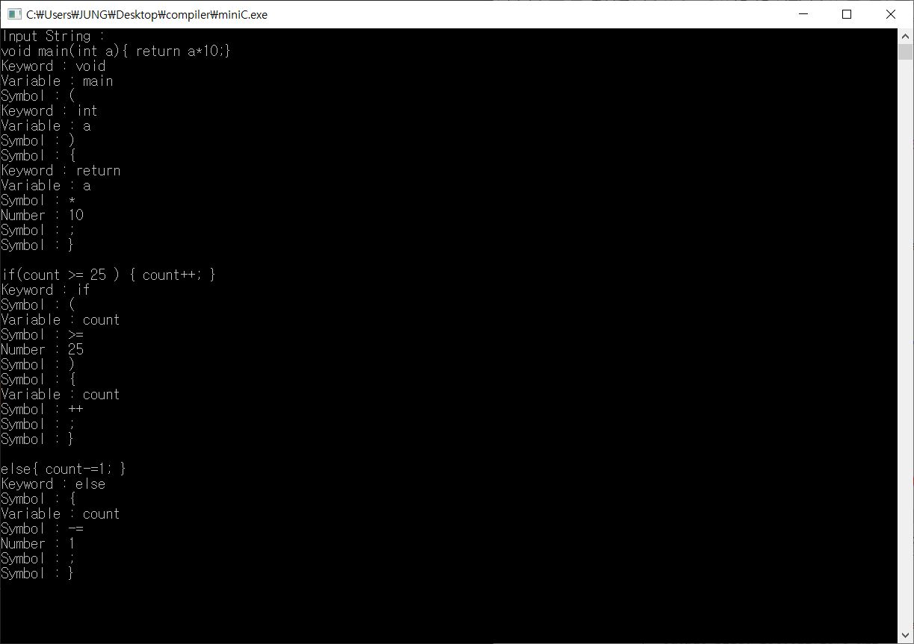

# 프로젝트 소개

mini C 언어에 대한 어휘 분석기 프로그램입니다.

 
 

# 개발 인원

1명(개인 프로젝트)

 
 

# 개발 기간

2020.06.18~2020.06.19(2일)

 
 

# 개발 환경

- 개발환경 : Windows 10 Enterprise x64
- 개발도구 : vscode, Dev C, Github
- 구성환경 : C

 
 

# 실행 스크린 샷

실행화면입니다.

 
 

# 프로젝트에 관한 설명

### keyword에 해당되는 것

const, else, if, int, return, void, while, or - ( 7개 )

### Symbol에 해당되는 것

+, +=, ++, -, -=, --, \*, ... , >, >=, ==, !=, <, <=, ||, &&, {, } 등

### number에 해당되는 것

숫자

### Variable에 해당되는 것

(keyword, symbol, number이 아닌 것 중에서) 
변수명 등 문자열
  

# 참고문헌

오세만,『컴파일러 입문』, 정익사(2010), p145-148
